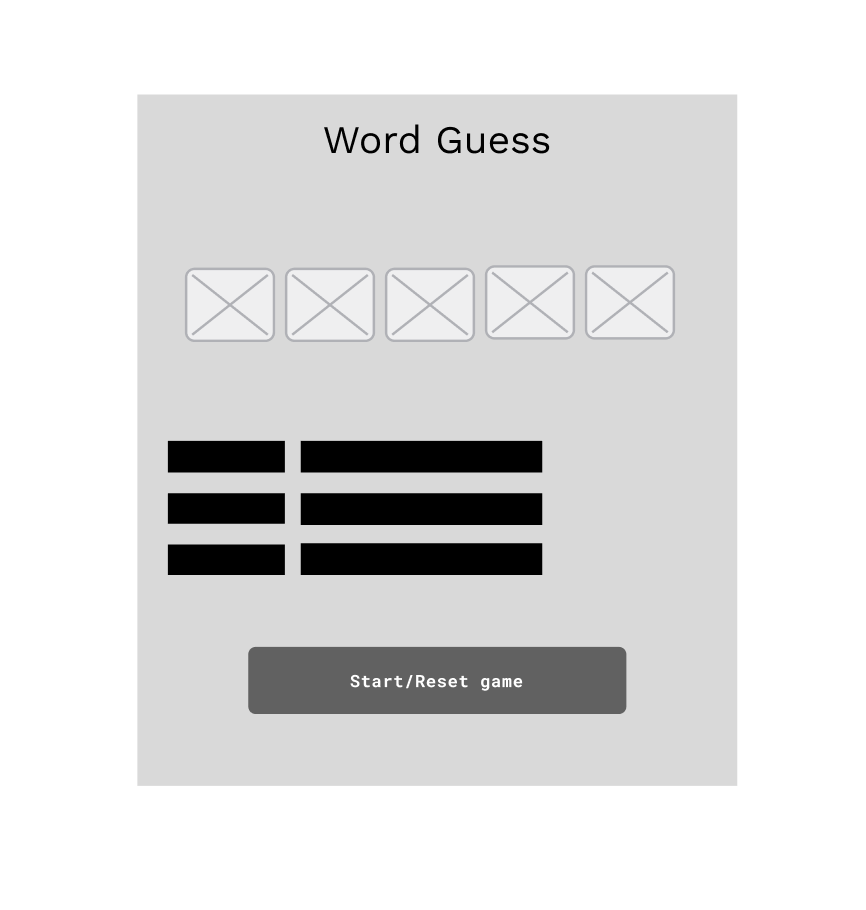
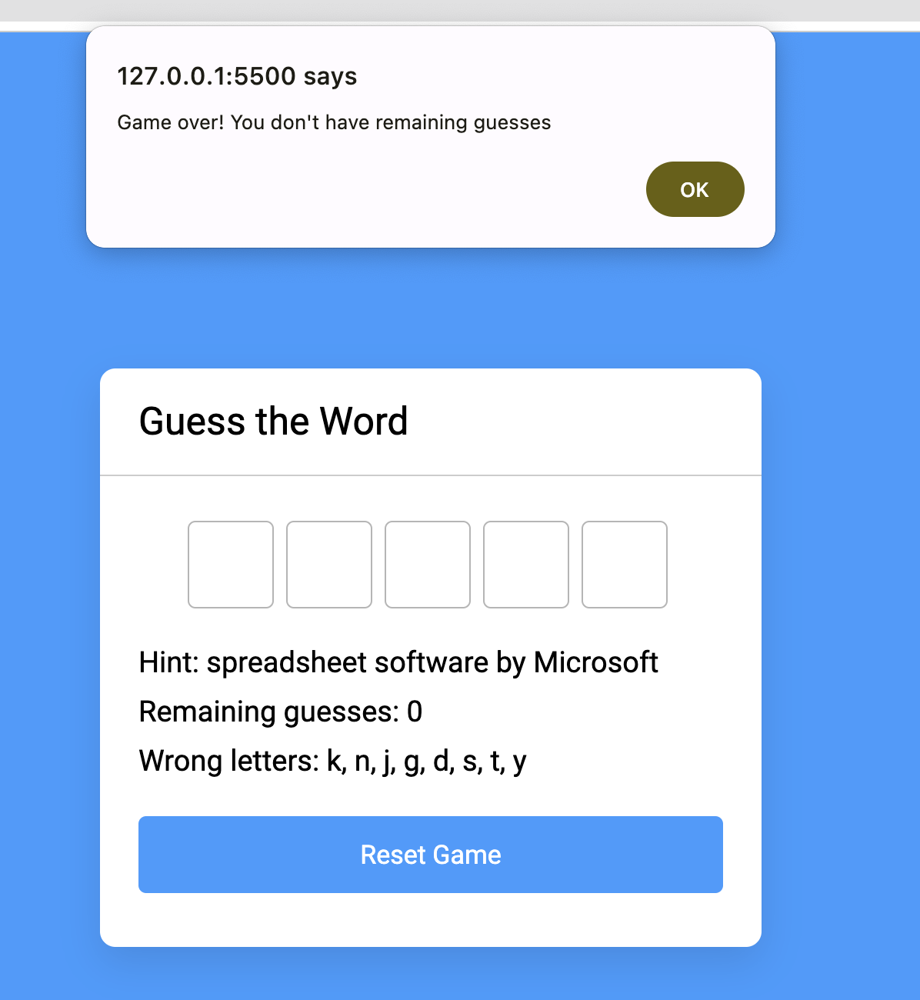

# **Word Mastermind**

## Site Overview

Word Mastermind is an engaging word-guessing game designed to showcase JavaScript in a practical scenario. Made for players who enjoy both challenges and language-related puzzles, Word Mastermind is a fully responsive game that encourages players to guess a randomly selected word. The game uses advanced JavaScript concepts to handle user input, track correct and incorrect guesses, and provide an interactive experience. With a limited number of guesses allowed, players must strategically input letters, and the game  updates the interface to reveal correct guesses. The project aims to offer an entertaining and educational experience, demonstrating the capabilities of JavaScript in creating interactive and dynamic web applications.

## **Introduction**
### **Target Audiences:**
* Word Puzzle enthusiasts: Users who are fans of word games looking for a  dynamic experience with a diverse range of words and hints.

* Casual Gamers: Users who seek a casual yet stimulating gaming experience, where they can exercise their word-guessing skills without complexity.
  
### **Wireframes**

## Features 
### Existing Features

 - User Interface: The user interface  updates to reflect correct and incorrect guesses, providing real-time feedback. This feature enhances the overall gaming experience, allowing players to see the impact of their decisions instantly.

- Word Randomisation: The game selects a random word from a predefined list, ensuring variety and unpredictability in each round. This feature adds excitement and challenge for users who seek diverse and unpredictable word puzzles.

- Hint Display: A hint associated with the selected word is  displayed, helping users in making informed guesses. This is beneficial for players who will need guidance in their word-guessing.

- Limited Guesses: The game imposes a limit on the number of incorrect guesses a player can make, introducing an element of strategy and urgency. This feature adds a layer of difficulty, making the game suitable for those who enjoy challenging puzzles.

- Responsive Design: The game is designed to be fully responsive, ensuring a seamless experience across various devices. This accommodates users who prefer to play the game on different platforms, including desktops, tablets, and mobile devices.

Desktop 

Tablet

Mobile

- Game Over Alerts: When the game concludes, either through successful word completion or the exhaustion of allowed guesses, the user receives a clear alert. This feature ensures that players are aware of the game outcome and can easily navigate to the next round.

- User-Friendly Reset: A reset button enables users to start a new round with a different word, adding replayability. This is particularly useful for players who enjoy the challenge of guessing multiple words consecutively.

- 
Accessibility: The game includes focus-related event listeners, making it accessible for users who prefer keyboard input. This ensures a user-friendly experience for individuals with diverse preferences and needs.

- Timeout for Final Letter Display: A subtle timeout delay is implemented for the final letter display, if the user inputs the correct final letter than an alert screen pops up to congratulate the player. This feature enhances the overall gaming experience, providing a satisfying end to each round.

## Testing 

### Validator Testing 

- HTML
    - No errors were returned when passing through the official [W3C validator](assets/images/W3C_validated.png)
- CSS
    - No errors were found when passing through the official [(Jigsaw) validator](assets/images/CSS%20validated.png)
- JavaScript
    - No errors were found when passing through the official [Jshint validator](https://jshint.com/)
      - The following metrics were returned: 
      - There are 5 functions in this file.
      - Function with the largest signature take 1 arguments, while the median is 0
      -  Largest function has 12 statements in it, while the median is 6.
      -  The most complex function has a cyclomatic complexity value of 7 while the median is 2.

- Lighthouse
  [Lighthouse](/assets/images/Lighthouse.png)

## Deployment

Deployment of the page on GitHub was carried out by the following steps: -

1. On the project's repository word-guess-game, I go to the Settings tab.
2. From the left-hand menu, the Pages tab is selected.
3. Under the Branch section, select the Main branch from the drop-down menu and click Save.
4. Refresh the page and deployment to GitHub pages will occur with a live link.

The live link can be found here - https://skopezz.github.io/word-guess-game/

## Credits 

I would like to thank Komal for his guidance and support. I would like to thank AB on how to learn Javascript. I would like to thank Beth as well.

### Content 

- The list of words were generated from Chat GPT 
- The code was inspired from the following website -  [Coding Nepal](https://www.codingnepalweb.com/word-guessing-game-html-css-javascript/)

